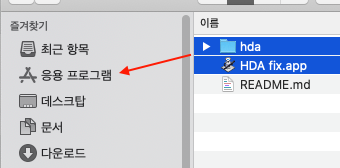
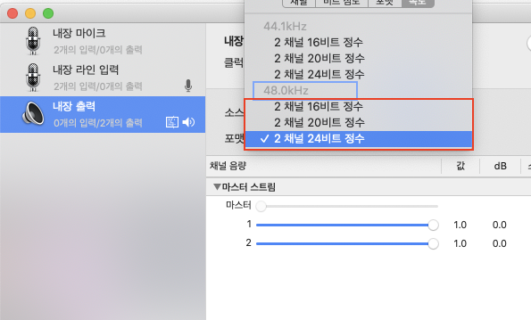

# 내장 스피커/이어폰 잭 픽스

1. hda폴더와 HDA fix.app을 다운받아 /Applications 에 넣어줍니다.

2. 시스템 환경설정→사용자 및 그룹→로그인 항목에서 +를 눌러 HDA fix.app을 추가합니다.
3. 재부팅을 하거나 HDA fix.app을 실행합니다.

4. 오디오 MIDI 설정 앱을 열어 내장 출력의 포맷을 48.0kHz로 변경하면 내장 스피커의 금속성 잡음이 사라집니다.

### 참고

https://bugs.launchpad.net/ubuntu/+source/linux/+bug/1851518

https://github.com/tkrotoff/Gigabyte-GA-Z77-DS3H-rev1.1-Hackintosh/issues/3