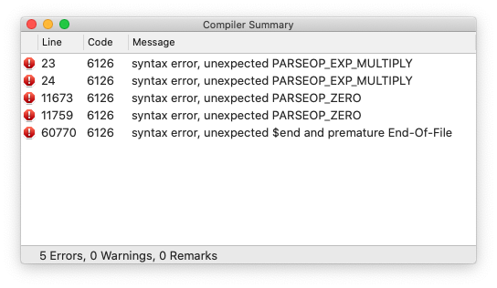
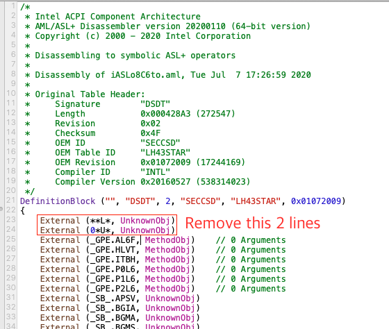
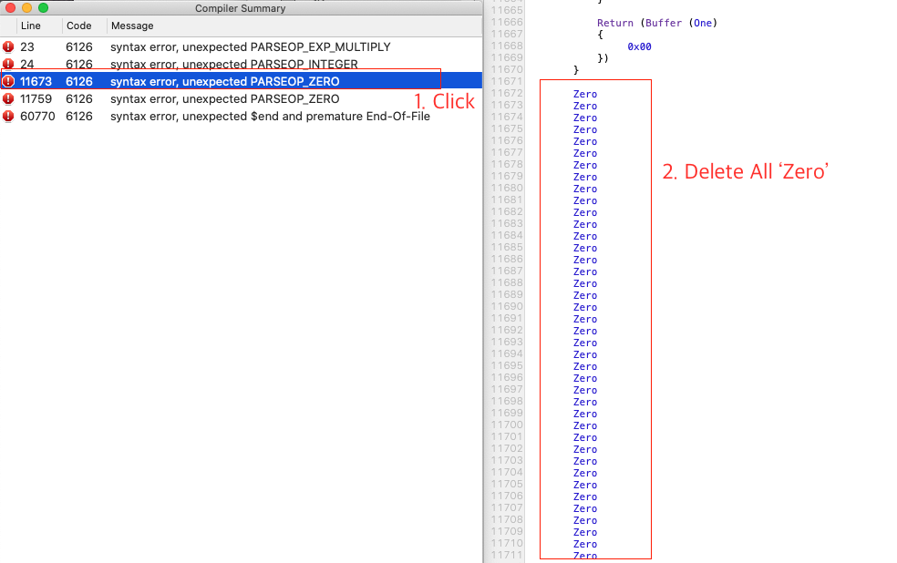
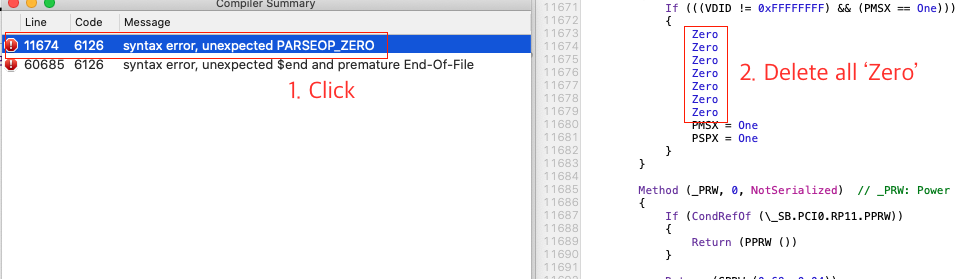
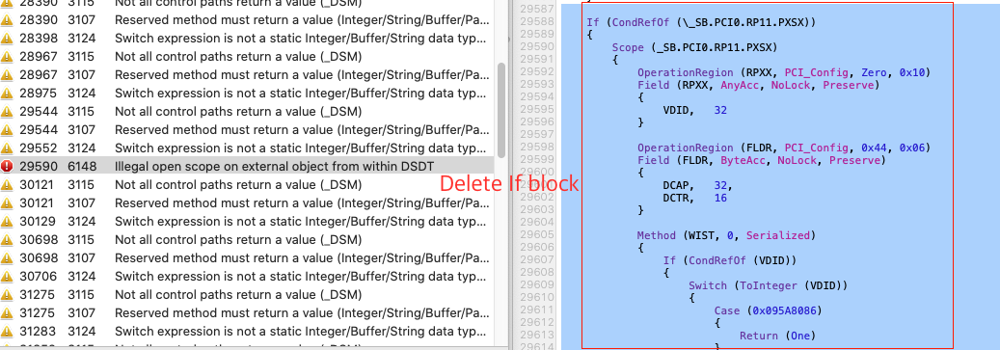

# NT950XCR-G58A-Hackintosh
 Samsung Galaxy Book Ion OpenCore EFI Firmware

## Summary

OpenCore EFI for Samsung GalaxyBook Ion(NT950XCR-G58A)

OC Version: v0.6.1

### Kexts

- AppleALC v1.5.2 : audio fix
- CodecCommander v2018-1003 : eapd fix
- IntelBluetoothFirmware v1.1.2 : bluetooth fix
- IntelBluetoothInjector v1.1.2 : bluetooth fix
- Itlwmx v1.0.0 : ax201 fix
- Lilu v1.4.7
- NVMeFix v1.0.3 : pm981a fix
- SMCBatteryManager v1.1.6
- SMCLightSensor v1.1.6
- SMCProcessor v1.1.6
- SMCSuperIO v1.1.6
- VirtualSMC v1.1.6
- VoodooI2C v2.4.4
- VoodooI2CHID v2.4.4
- VoodooPS2Controller v2.1.6 : internal keyboard fix
- WhateverGreen v1.4.2

### EFI

- ApfsDriverLoader v2.1.6
- HfsPlus v2.1.6
- OpenRuntime v2.1.6

### SSDT/DSDT

- dsdt-patched : original dsdt + battery indicator fix + backlight control hotkey fix (this dsdt work on NT950XCR-G58A only, other model users have to make your dsdt with my patches)
- SSDT-AWAC
- SSDT-GPIO
- SSDT-PLUG
- SSDT-PNLF-CFL : backlight fix
- SSDT-SBUS-MCHC
- SSDT-dGPU-Off
- SSDT-EC-USBX
- SSDT-UIAC

## How to Use

1. Copy EFI folder to your macOS Install USB
2. Extract DSDT from your laptop and apply my dsdt patches
3. Compile and put DSDT into \<your usb\>/EFI/ACPI
4. Let's enjoy!

### How to fix DSDT error

If you've extracted DSDT, you will get 5 errors.

#### PARSEOP_EXP_MULTIPLY

This error is caused by '*' mark in wrong place.

So, remove this lines, then the error will be disappeared.

#### PARSEOP_ZERO

This error is caused by 'Zero' in wrong place.

Click error line to go to the line, then remove all 'Zero' lines.

#### Illegal open scope on external object from within DSDT

If you click compile button after fixing 5 errors, you will get many warnings and new errors.

Look at this error.

That If statement means that if '_SB.PCI0.RP11.PXSX' exists, execute scope below.

In other words, if PXSX not exist, it never run these codes.

But the complier says, where is PXSX? ur trying to access wrong device!!! get the fxxking ERROR.

Anyway, you have to follow below steps to fix errors.

##### Remove all error blocks

These codes is never executed because PXSX doesn't exist, so you can delete all error lines.

### EAPD Fix

(thx to K맑은삶)

1. Download CodecCommander [here](https://bitbucket.org/RehabMan/os-x-eapd-codec-commander/downloads/).

2. Put a command below into terminal.

`sudo ./hda-verb 0x1a SET_PIN_WIDGET_CONTROL 0xc5`

## Spec

- NT950XCR-G58A
- Intel Core i5-10210u
- Intel UHD Graphics 620
- NVIDIA Geforce MX250 (disabled on macOS)
- 1 x Samsung 8GB DDR4 ????MHz (onboard)
- 1 x Samsung pm981a NVMe M.2 SSD 256 GB (for win10)
- 1 x Toshiba BG3 NVMe M.2 SSD 128 GB (for macOS)
- Intel AX201

## It Works

- Keyboard / Trackpad
- Bluetooth
- USB ports
- Battery indicator
- Display brightness control
- Detecting filp display
- Webcam
- Fn hot key (volume, brightness contol)
- SD/UFS Slot
- QE/CI
- Sleep
- HDMI output
- Earphone jack
- WiFi

## It doesn't work

- Sleep on closing display cover
- Internal speaker/mic
- Fingerprint sensor
- Wireless charging on trackpad

## Unknown

- USB PD
- Brightness sensor
- ThunderBolt 3

## BIOS settings

- TPM Device: Off
- Secure Boot Control: Off
- Fast BIOS Mode: Off
- USB LAN PXE OPROM: Off

## References

- https://dortania.github.io/vanilla-laptop-guide
- https://www.tonymacx86.com/threads/guide-how-to-patch-dsdt-for-working-battery-status.116102/
- https://www.insanelymac.com/forum/topic/305030-guide-how-to-fix-brightness-hotkeys-in-dsdt/
- https://github.com/daliansky/XiaoXinPro-13-hackintosh
- https://x86.co.kr/tip/5155874
