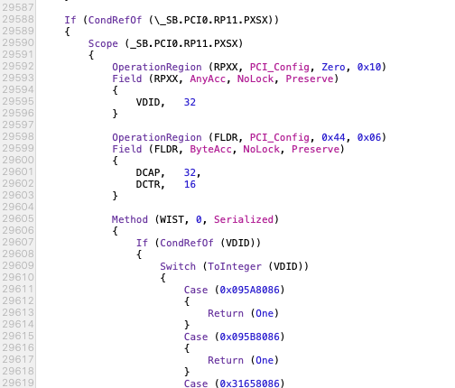

# NT950XCR-G58A-Hackintosh
 Samsung Galaxy Book Ion OpenCore EFI Firmware

[English version](./README-en.md)

## 개요

삼성 갤럭시북 이온(NT950XCR-G58A)에서 사용가능한 EFI입니다.

오픈코어(OpenCore) v0.5.9을 사용합니다.

### 특이사항

- 무슨 짓을 해도 사운드 안 잡힘(AppleALC, VoodooHDA, AppleHDA patch 등 관련 패치 전부 작동 안 함) (+ VoodooHDA 사용 시 Ubuntu에서 생기는 문제와 동일한 문제 발생)

### Kexts

- AppleALC v1.5.0 : audio fix (not working)
- IntelBluetoothFirmware v1.1.1 : bluetooth fix
- IntelBluetoothInjector v1.1.1 : bluetooth fix
- Lilu v1.4.5
- NVMeFix v1.0.2 : pm981a fix
- SMCBatteryManager v1.1.4
- SMCLightSensor v1.1.4
- SMCProcessor v1.1.4
- SMCSuperIO v1.1.4
- VirtualSMC v1.1.4
- VoodooI2C v2.4.3
- VoodooI2CHID v2.4.3
- VoodooPS2Controller v2.1.5 : internal keyboard fix
- WhateverGreen v1.4.0

### EFI

- ApfsDriverLoader v2.1.6
- HfsPlus v2.1.6
- OpenRuntime v2.1.6

### SSDT/DSDT

- dsdt-patched : 원본 dsdt + 배터리 게이지 수정 + FN키 수정 (i5, 외장그래픽 모델에서만 작동합니다. 다른 모델은 아래 과정을 통해 직접 DSDT 패치하세요)
- SSDT-AWAC
- SSDT-GPIO
- SSDT-PLUG
- SSDT-PNLF-CFL : backlight fix
- SSDT-SBUS-MCHC
- SSDT-dGPU-Off
- SSDT-EC-USBX
- SSDT-UIAC

## 설치하는 법

1. macOS 설치 USB를 만든 다음 EFI 폴더를 USB의 EFI 파티션에 넣습니다.
2. DSDT를 추출하여 후술하는 방법을 따라 오류를 수정한 뒤, [첨부된 DSDT 패치](./DSDT Patches)를 사용해 패치합니다.
3. 수정한 DSDT를 컴파일하고 \<usb\>/EFI/ACPI 폴더에 'dsdt-patched.aml'라는 이름으로 덮어쓰기합니다.
4. 끘

### DSDT 오류 수정

DSDT 추출하면 5개의 에러가 보일 겁니다.

#### PARSEOP_EXP_MULTIPLY

이 오류는 \* 기호가 엉뚱한 데 들어가 있어서 생기는 오류입니다.

다음 두 줄을 제거하면 오류가 사라집니다.

#### PARSEOP_ZERO

이 오류는 Zero 가 엉뚱한 데 들어가 있어서 생기는 오류입니다.

Zero 만 있는 줄을 모두 제거하면 오류가 사라집니다.

#### Illegal open scope on external object from within DSDT

앞선 두 가지 오류를 해결하고 Complie 버튼을 눌러 보면 수많은 에러와 경고들이 여러분을 반길 겁니다.

경고는 모두 무시해도 상관 없지만 3개의 에러는 해결해야 합니다.

에러가 난 곳을 확인해 봅시다.

오류가 난 곳을 감싸고 있는 IF문의 의미는 \_SB.PCI0.RP11.PXSX가 존재한다면 다음 코드를 실행해라. 라는 뜻입니다.

하지만 저 멍청한 컴파일러는 PXSX? 그런 거 없는뒈여? 에러나 처드세연~ ㅇㅈㄹ하고 있는 겁니다.

이 에러를 해결하기 위해서는 그냥 해당하는 코드를 제거하면 됩니다.

실제로 PXSX가 DSDT 내에 존재하지 않기 때문에 어차피 이 코드들은 실행되지 않습니다.

따라서 이 블록들을 모두 삭제해도 좋습니다.

## 사양

- NT950XCR-G58A
- Intel Core i5-10210u
- Intel UHD Graphics 620
- NVIDIA Geforce MX250 (비활성화)
- 1 x Samsung 8GB DDR4 ????MHz (온보드)
- 1 x Samsung pm981a NVMe M.2 SSD 256 GB (윈도우용)
- 1 x Toshiba BG3 NVMe M.2 SSD 128 GB (맥 설치용)
- iptime n100 mini (USB로 추가 장착)

## 작동하는 것

- 키보드 / 트랙패드
- 블루투스
- USB 포트
- 배터리 상태 확인
- 화면 밝기 조절
- 화면 커버 인식
- 전면 카메라
- 밝기 조절/볼륨 핫키
- SD/UFS 슬롯
- QE/CI
- 잠자기
- HDMI 출력
- 썬더볼트3 단자

## 안 되는 것

- 소리
- WiFi
- 지문인식
- 트랙패드 무선충전

## 확인되지 않은 것

- USB PD
- 조도 센서

## BIOS 설정

- TPM Device: Off
- Secure Boot Control: Off
- Fast BIOS Mode: Off
- USB LAN PXE OPROM: Off

## 참고자료

- https://dortania.github.io/vanilla-laptop-guide
- https://www.tonymacx86.com/threads/guide-how-to-patch-dsdt-for-working-battery-status.116102/
- https://www.insanelymac.com/forum/topic/305030-guide-how-to-fix-brightness-hotkeys-in-dsdt/
- https://github.com/daliansky/XiaoXinPro-13-hackintosh